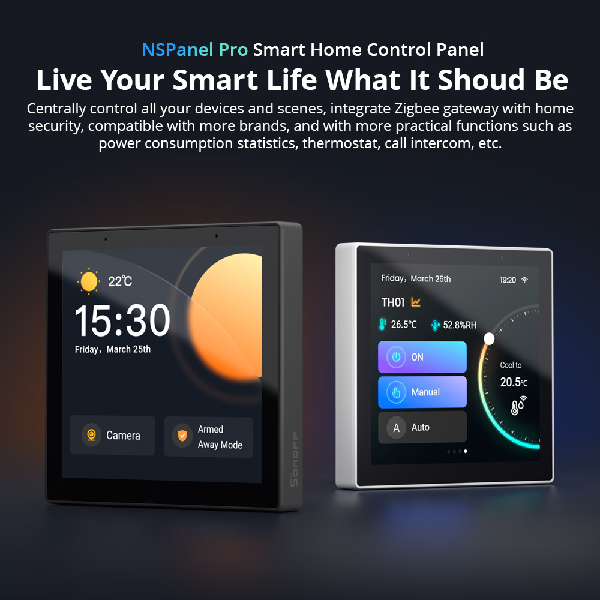

## Table of contents
- [Device information ](#sonoff-nspanel-pro)
- [What is NSPanel Pro Root tool](#nspanel-pro-roottool)
- [Frequently Asked Questions](#frequently-asked-questions)
- [Get out from rabbit hole](#get-out-from-rabbit-hole)

## Sonoff NSPanel Pro

Sonoff NSPanel Pro is a smart home control panel which based on Android 8.1 Oreo (AOSP) system.

> [!WARNING]
> Never start to sideload or root the device without at least launching the eWeLink App once on the device.

After gain ADB access custom applications can be installed onto this unit. See (https://blakadder.com/nspanel-pro-sideload/)

https://itead.cc/product/sonoff-nspanel-pro-smart-home-control-panel/

## NSPanel Pro Roottool 

After enabling Development mode on the device via eweLink App further official firmware updates are prohibited according to the accepted EULA.

This tool allows you to install the official OTA firmwares only.

> [!WARNING]
> Warning, this software has been created for experimental purposes only. Perform any modifications on the device at your own risk. I assume no responsibility for any consequences of using the software!

# Frequently Asked Questions

- [Where can I download the official update packages?](#where-can-i-download-the-official-update-packages)
- [Can I disable the developer mode, somehow?](#can-i-disable-the-developer-mode-somehow)
- [How do I reset the device?](#how-do-i-reset-the-device)
- [Is there any benefit to update the sideloaded panel?](#is-there-any-benefit-to-update-the-sideloaded-panel)
- [What should I do if my device has entered factory mode?](#what-should-i-do-if-my-device-has-entered-factory-mode)

## Where can I download the official update packages?

https://drive.google.com/drive/folders/1bHLLJy8vYUjkCCnyUmrHgEFWi_2cxywv

## Can I disable the developer mode, somehow?

Short answer is you can't. Reffering to the eWeLink App you were asked asked numerous times if you are sure and fully aware of the consequences. What you accepted. So the device rooted forever.

## How do I reset the device?

Power on the device and wait until the Sonoff logo boot animation starts playing then power it off. Power it on again and repeat the process 5 times. After that the panel will boot into “Update Firmware Protect Mechanism” and factory reset everything to the version stored in the recovery partition.​

[more details](https://blakadder.com/nspanel-pro-secrets)

## Is there any benefit to update the sideloaded panel?

I've analyzed all the system updates till 1.11.
From OS perspective it is intact and it is still the AOSP 8.1 Oreo, so to simplify the android binaries in the 1.3 are equivallent to 1.7.
The rockchip drivers also looks the same.
Of course the vendor part is different for example the ControlApp and the internal zigbee server.

As a "sideload user" definitely there is no reason to upgrade to higher version. If you want to mix Sonoff Ecosystem and HASS usage could be a benefit. But some new feature is limited to a "non-rooted" user such as intercom calling between the devices even if you upgrade fw and force ugrade the apk (normally if you are rooted wont get any update).

## What should I do if my device has entered factory mode?

If you encouter the following screen:

Especially if you see a QRCode, you lost the licence data. 

> [!WARNING]
> Never start to sideload the device without at least launching the eWeLink App once device.

Do the [Get out from rabbit hole](#get-out-from-rabbit-hole)

## Get out from rabbit hole

- Disassemble the unit
- Connect +5V to the 5V pin and ground to GND pin min 2A DC powersource is required

> [!CAUTION]
> Make sure of the proper connection, you can see the pinout labels under the pinheader!

- Connect the **OTG cable** with a connected keyboard thats why I suggested to buy a USB-micro to USB-A
- After the device is booted and the ewelink pair app appeared press Windows + N key on your keyboard
- Navigate to Quick settings and enter
- Under Settings go to Wif and connect device to Wifi
- Under Setting go to System -> Developer options -> USB debugging enbale
- Check ip address

Now without reboot do the adb connect and install a custom launcher
https://github.com/seaky/nspanel_pro_tools_apk?tab=readme-ov-file#install-custom-launcher

- Now you can reboot the device
- Every time if you start 